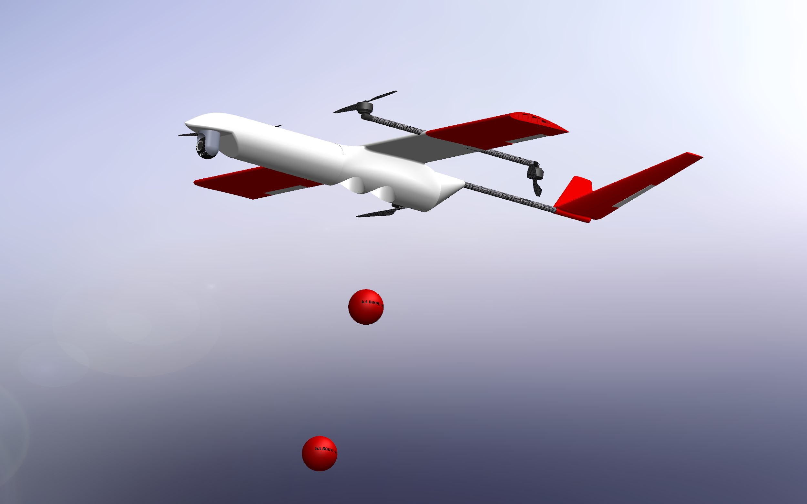
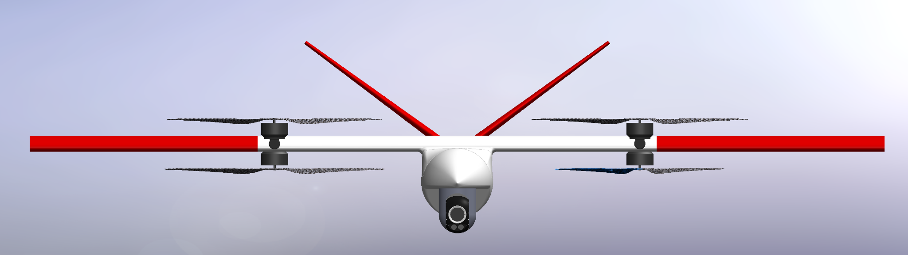
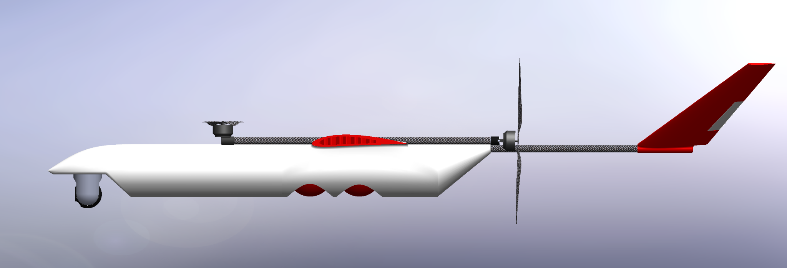

# Jäger-QRF — Rapid Response Firefighter VTOL Drone

Wildfires and structural fires can escalate in minutes, often before ground crews arrive. Existing aerial solutions such as helicopters and airtankers are typically not deployed until a fire has fully developed, requiring significant mobilization time, trained flight crews, and high operational costs. Small multirotor UAVs offer faster response but are limited by range and endurance, while conventional fixed-wing UAVs cannot hover for precise payload deployment.

**Jäger-QRF** is a conceptual rapid-response UAV designed to fill this gap. Autonomously deployed from a fire station, it cruises at 51.4 mph to arrive at the target ahead of ground vehicles, transitions to stable hover, and deploys two fire suppression munitions, each capable of suppressing a fire within a 3-meter radius, within 180 seconds of takeoff. After delivery, it returns to base, where a single operator can rearm and recharge it for the next sortie.

The hybrid VTOL architecture is the key design decision: a quadcopter configuration handles takeoff, hover, and landing without a runway, while two aft rotors tilt aft in forward flight and a fixed wing carries most of the cruise lift, significantly reducing power demand compared to hover-only flight. A forward-mounted FLIR turret provides thermal imaging for target identification in low-visibility fire environments.

Developed as a 6-person team project in MAE 155A — Aircraft Design at UC San Diego, the design is grounded in full aerodynamic, propulsion, structural, stability, and cost analyses. The manufacturing cost is estimated at $2,637 per unit with a break-even production quantity of 251 units — less than 1% of the approximately 27,000 fire departments in the United States.

---

## Mission Profile

The mission is time-critical: from launch to first payload release in under 3 minutes.

| Phase | Duration | Altitude |
|---|---|---|
| Takeoff & climb | 30 s | 0 → 400 ft |
| Outbound cruise | 65 s | 400 ft |
| Target acquisition & descent | 45 s | 400 → 25 ft |
| Payload delivery (×2) | 40 s/munition | 25 ft |
| Recovery & return | 38 s | 25 → 400 ft |

---

## Design

| Front view | Side profile |
|---|---|
|  |  |

## Key Design Parameters

| Parameter | Value |
|---|---|
| Gross weight | 55 lb (25 kg) |
| Payload | 2 × fire suppression munitions (3.3 lb each) |
| Cruise speed | ~51 mph (75 ft/s) |
| Range | 1.5 miles (one-way) |
| Max altitude | 400 ft AGL (FAA Part 107) |
| Drop altitude | 25 ft AGL |
| Wing airfoil | NACA 4412 |
| Aspect ratio | 6 |
| Wing area | 6.64 ft² |
| Wingspan | 6.31 ft |
| Disk loading | 250 N/m² |

---

## Aerodynamic Analysis

**Airfoil — NACA 4412**

**Lift curve and drag polar**

---

## Sizing and Constraints

Power-to-weight vs wing loading sizing diagram showing governing constraints (stall, climb, maneuver, hover).

---

## Stability

**Static margin** computed from CG and aerodynamic center locations across the fuselage axis.

**V-n diagram** including gust loads at cruise and dive speeds.

---

## MATLAB Analysis Code

| Script | Description |
|---|---|
| `VTOL_SizingV9Mk2.m` | Full VTOL sizing — weight, battery fractions, hover/cruise power, mission timing |
| `JagerAeroAnalysis.m` | Aerodynamic analysis — CL-alpha curve, drag polar, parasite drag build-up from CAD wetted areas |
| `ParasiteDragV1.m` | Component-level parasite drag estimation |
| `CrusieSpeedCalc.m` | Cruise speed requirement from mission time budget |
| `Range_and_Weight.m` | Range and weight fraction trade |
| `Dynamic Stability Analysis/main_vtailSweep_JAGER.m` | AVL-based V-tail geometry sweep for dynamic stability |
| `Dynamic Stability Analysis/OptomizedDynamicsStabillityAnalysisV2.m` | Optimized dynamic stability analysis |
| `Control/JAGER_AVL_AUTORUN_CONTROL_SIZING_V8_OFFTIP_SPREADSHEET.m` | Control surface sizing via AVL automation |

---

## Documents

- `CoDR/CoDR Jager-V5.pptx` — Full Conceptual Design Review presentation
- `Weight & Balance Master.xlsx` — Component-level weight and balance breakdown
- `CAD files/Drawings/` — Assembly drawings (PDF)

---

## Team

6-person team, MAE 155A — Aircraft Design, UC San Diego (Winter 2026).
Juan Manuel Sanchez contributed aerodynamic analysis, MATLAB sizing code, and dynamic stability analysis.
